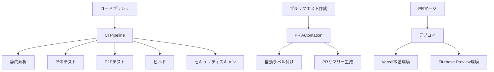

# GitHub Actions CI/CD環境構築ガイド

このガイドでは、GitHub ActionsによるCI/CD（継続的インテグレーション・継続的デプロイメント）環境の構築とテスト方法を初学者向けに分かりやすく説明します。

## 目次

1. [CI/CDとは](#cicdとは)
2. [このプロジェクトのCI/CD構成](#このプロジェクトのcicd構成)
3. [GitHub Actionsの設定方法](#github-actionsの設定方法)
4. [ワークフローファイルの詳細解説](#ワークフローファイルの詳細解説)
5. [シークレットの設定方法](#シークレットの設定方法)
6. [CI/CDのテスト方法](#cicdのテスト方法)
7. [トラブルシューティング](#トラブルシューティング)
8. [ベストプラクティス](#ベストプラクティス)

---

## CI/CDとは

### CI（継続的インテグレーション）
- **目的**: コードの変更を頻繁にメインブランチに統合
- **メリット**: バグの早期発見、品質向上、開発効率UP

### CD（継続的デプロイメント）
- **目的**: テストをパスしたコードを自動的に本番環境にデプロイ
- **メリット**: リリース作業の自動化、人的ミスの削減

### GitHub Actionsとは
- GitHubが提供するCI/CDプラットフォーム
- YAMLファイルでワークフローを定義
- プッシュやプルリクエストを契機に自動実行

---

## このプロジェクトのCI/CD構成

### 現在の構成概要



### ワークフローファイル構成

```
.github/workflows/
├── ci.yml                # メインのCI/CDパイプライン
├── preview.yml           # プレビューデプロイメント
├── pr-automation.yml     # PR自動化
└── branch-protection.yml # ブランチ保護設定
```

---

## GitHub Actionsの設定方法

### 1. リポジトリでのActions有効化

1. **GitHubリポジトリにアクセス**
2. **Settings タブをクリック**
3. **左サイドバーの Actions → General をクリック**
4. **Actions permissions で以下を選択**:
   - ✅ Allow all actions and reusable workflows

### 2. 必要な権限設定

**Settings → Actions → General → Workflow permissions:**
- ✅ Read and write permissions
- ✅ Allow GitHub Actions to create and approve pull requests

---

## ワークフローファイルの詳細解説

### 1. メインCI/CDパイプライン（ci.yml）

#### トリガー条件
```yaml
on:
  push:
    branches: [ main, develop ]
  pull_request:
    branches: [ main, develop ]
```

#### 実行ジョブと内容

| ジョブ名 | 実行内容 | 実行タイミング |
|----------|----------|----------------|
| **test** | TypeScript・ESLint・単体テスト・E2E・ビルド | 全プッシュ・PR |
| **require-tests-for-develop** | develop向けPRの必須テスト | develop向けPR |
| **require-tests-for-main** | 本番向けPRの必須テスト | main向けPR |
| **security** | セキュリティスキャン・脆弱性チェック | PR作成時 |

#### Node.jsマトリックス戦略
```yaml
strategy:
  matrix:
    node-version: [18.x, 20.x]
```
複数のNode.jsバージョンでテストを実行し、互換性を確認。

### 2. プレビューデプロイメント（preview.yml）

#### 特徴
- **mainブランチ**へのPR作成時に自動実行
- **Firebase Hosting**にプレビュー環境をデプロイ
- **7日間**の自動削除機能
- **PRコメント**でプレビューURL自動通知

#### 実行フロー
```yaml
1. コードチェックアウト
2. Node.js環境セットアップ
3. 依存関係インストール
4. アプリケーションビルド
5. Firebase Hostingにデプロイ
6. PRにプレビューURLをコメント
```

### 3. PR自動化（pr-automation.yml）

#### 主な機能

**自動ラベル付け**:
- タイトルベース: `feat` → `✨ feature`
- ファイルベース: `.tsx` → `⚛️ react`
- サイズベース: 変更量に応じて `📦 size/S~XL`

**PRサマリー生成**:
- 変更統計（追加・削除行数）
- ファイルタイプ別変更数
- レビューポイント提案

**レビュー後アクション**:
- 承認通知とマージガイド
- 承認者リスト表示

---

## シークレットの設定方法

### 1. GitHubリポジトリでのシークレット設定

1. **リポジトリ → Settings → Secrets and variables → Actions**
2. **New repository secret をクリック**
3. **必要なシークレットを追加**

### 2. 必要なシークレット一覧

| シークレット名 | 用途 | 取得方法 |
|----------------|------|----------|
| `VITE_FIREBASE_API_KEY` | Firebase認証 | Firebaseコンソール |
| `VITE_FIREBASE_AUTH_DOMAIN` | Firebase認証ドメイン | Firebaseコンソール |
| `VITE_FIREBASE_PROJECT_ID` | FirebaseプロジェクトID | Firebaseコンソール |
| `VITE_FIREBASE_STORAGE_BUCKET` | Firebaseストレージ | Firebaseコンソール |
| `VITE_FIREBASE_MESSAGING_SENDER_ID` | Firebaseメッセージング | Firebaseコンソール |
| `VITE_FIREBASE_APP_ID` | Firebase アプリID | Firebaseコンソール |
| `FIREBASE_SERVICE_ACCOUNT` | Firebaseサービスアカウント | Firebase CLI |
| `FIREBASE_PROJECT_ID` | FirebaseプロジェクトID | Firebaseコンソール |

### 3. Firebaseサービスアカウント取得方法

```bash
# Firebase CLIインストール
npm install -g firebase-tools

# ログイン
firebase login

# サービスアカウントキー生成
firebase projects:list
firebase use YOUR_PROJECT_ID
```

Firebaseコンソール → プロジェクト設定 → サービス アカウント → 新しい秘密鍵の生成

---

## CI/CDのテスト方法

### 1. 基本的なテストフロー

#### Step 1: 機能ブランチでの作業
```bash
# 新しい機能ブランチ作成
git checkout -b feature/new-component

# コード変更・実装
echo "新しいコンポーネント" > src/components/NewComponent.jsx

# コミット・プッシュ
git add .
git commit -m "feat: add new component"
git push origin feature/new-component
```

#### Step 2: プルリクエスト作成
1. GitHubでプルリクエストを作成
2. `develop` または `main` ブランチをターゲットに指定
3. 自動的にCI/CDが開始される

#### Step 3: CI/CDの実行確認
GitHubの **Actions タブ** で以下を確認：

✅ **実行ステータス**:
- 🟢 成功（All checks passed）
- 🔴 失敗（Some checks failed）
- 🟡 進行中（In progress）

### 2. 各ワークフローのテスト方法

#### テスト1: メインCI/CDパイプライン
**トリガー**: `develop` または `main` へのプッシュ・PR

**確認項目**:
- [ ] TypeScriptコンパイルエラーなし
- [ ] ESLintエラーなし
- [ ] 単体テストパス
- [ ] E2Eテストパス（Playwright）
- [ ] Storybookビルド成功
- [ ] アプリケーションビルド成功

**テスト手順**:
```bash
# 意図的にエラーを含むコードを作成してテスト
echo "const test = 'type error" > src/test-error.js
git add . && git commit -m "test: intentional error" && git push
```

#### テスト2: プレビューデプロイメント
**トリガー**: `main` ブランチへのPR作成

**確認項目**:
- [ ] Firebase Hostingにデプロイ成功
- [ ] プレビューURLがPRにコメントされる
- [ ] プレビュー環境でアプリが正常動作
- [ ] 7日後の自動削除スケジュール

#### テスト3: PR自動化
**トリガー**: PR作成・更新・レビュー

**確認項目**:
- [ ] タイトルに基づく自動ラベル付け
- [ ] ファイル変更に基づくラベル付け
- [ ] PRサマリーコメント生成
- [ ] レビュー承認後の祝福メッセージ

### 3. 手動テストコマンド

CI/CDで実行される内容をローカルで事前確認：

```bash
# TypeScriptチェック
npm run type-check

# ESLintチェック
npm run lint

# 単体テスト実行
npm run test

# E2Eテスト実行（要Playwright環境）
npm run test:e2e

# Storybookビルド
npm run build-storybook

# アプリケーションビルド
npm run build
```

---

## トラブルシューティング

### よくあるエラーと解決方法

#### 1. ビルドエラー

**エラー例**:
```
Error: Module not found: Can't resolve './nonexistent-file'
```

**解決方法**:
```bash
# ローカルでビルドテスト
npm run build

# 依存関係の再インストール
rm -rf node_modules package-lock.json
npm install
```

#### 2. テスト失敗

**エラー例**:
```
Tests failed: 2 failing, 5 passing
```

**解決方法**:
```bash
# 単体テストをローカルで実行
npm run test

# E2Eテストをローカルで実行
npm run test:e2e
```

#### 3. 環境変数エラー

**エラー例**:
```
Error: Firebase API key is not defined
```

**解決方法**:
1. GitHubリポジトリの Secrets 設定を確認
2. 環境変数名のスペルミスをチェック
3. `VITE_`プレフィックスが付いているか確認

#### 4. 権限エラー

**エラー例**:
```
Error: Resource not accessible by integration
```

**解決方法**:
1. リポジトリ Settings → Actions → General
2. Workflow permissions を "Read and write" に設定
3. "Allow GitHub Actions to create and approve pull requests" を有効化

#### 5. プレビューデプロイエラー

**エラー例**:
```
Error: Firebase project not found
```

**解決方法**:
1. `FIREBASE_PROJECT_ID` の値を確認
2. `FIREBASE_SERVICE_ACCOUNT` が正しく設定されているか確認
3. Firebase プロジェクトでHosting機能が有効になっているか確認

### デバッグ方法

#### 1. ログの確認
```
GitHub → Actions タブ → 該当ワークフロー → 詳細ログ表示
```

#### 2. ローカルデバッグ
```bash
# act（GitHubActions ローカル実行ツール）使用
npm install -g @github/act
act pull_request
```

#### 3. ステップバイステップ確認
各ステップのログを個別に確認し、どこで失敗したかを特定。

---

## ベストプラクティス

### 1. ワークフロー設計のポイント

#### 効率的なジョブ実行
```yaml
# 並列実行でビルド時間短縮
jobs:
  test:
    strategy:
      matrix:
        node-version: [18.x, 20.x]
  
  security:
    runs-on: ubuntu-latest
    if: github.event_name == 'pull_request'
```

#### 条件分岐で無駄な実行を避ける
```yaml
# develop向けPRの場合のみ実行
if: github.event_name == 'pull_request' && github.base_ref == 'develop'
```

#### キャッシュを活用
```yaml
- name: Setup Node.js
  uses: actions/setup-node@v4
  with:
    node-version: ${{ env.NODE_VERSION }}
    cache: 'npm'  # npm キャッシュで高速化
```

### 2. セキュリティのベストプラクティス

#### シークレットの適切な管理
- ❌ ハードコーディング禁止
- ✅ GitHub Secrets使用
- ✅ 最小権限の原則

#### 脆弱性スキャンの実装
```yaml
- name: 🔒 Run security audit
  run: npm audit --audit-level high
  
- name: 🔍 Dependency vulnerability scan
  uses: actions/dependency-review-action@v4
```

### 3. モニタリングとアラート

#### 失敗時の通知設定
```yaml
- name: Notify on failure
  if: failure()
  uses: actions/github-script@v7
  with:
    script: |
      // Slackやメール通知の設定
```

#### メトリクス収集
- ビルド時間の監視
- テスト成功率の追跡
- デプロイ頻度の測定

### 4. ブランチ戦略との連携

#### Git Flow との統合
```yaml
# ブランチごとの動作定義
on:
  push:
    branches: [ main ]      # 本番デプロイ
    branches: [ develop ]   # 開発環境デプロイ
  pull_request:
    branches: [ main, develop ]  # 品質チェック
```

---

## まとめ

このガイドで学習できる内容：

### ✅ 構築済み機能
1. **自動品質チェック**: TypeScript・ESLint・テスト実行
2. **自動ビルド・デプロイ**: Vercel・Firebase連携
3. **プレビュー環境**: PR単位での環境作成
4. **PR自動化**: ラベル付け・サマリー生成
5. **セキュリティスキャン**: 脆弱性自動検出

### 🚀 さらなる改善案
1. **パフォーマンステスト**: Lighthouseスコア測定
2. **通知機能**: Slack・Discord連携
3. **カナリアデプロイ**: 段階的リリース
4. **自動ロールバック**: 障害時の自動復旧

### 📚 次のステップ
- [Vercelデプロイガイド](./VERCEL_DEPLOYMENT_GUIDE.md) との連携学習
- ブランチ保護ルールの詳細設定
- カスタムアクションの作成

---

## 関連リンク

- [GitHub Actions公式ドキュメント](https://docs.github.com/actions)
- [Firebase Hosting GitHub Action](https://github.com/FirebaseExtended/action-hosting-deploy)
- [Playwright GitHub Actions](https://playwright.dev/docs/ci-github-actions)
- [Vercel GitHub Integration](https://vercel.com/docs/concepts/git/vercel-for-github)